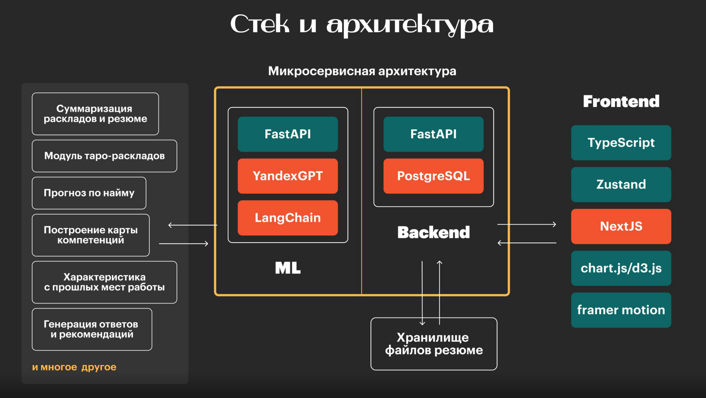

## Naimix: Code | MISIS GO

##### Наша команда разработала инновационную распределенную систему для прогнозирования и оптимизации подбора кандидатов с использованием Таро, применяя микросервисный подход для точной и персонализированной оценки.

### Демонстрация работы сервиса
------
1. #### [Ссылка на рабочий прототип](http://go.itatmisis.ru:80)
2. #### [Скринкаст работы сервиса](https://disk.yandex.ru/i/jbZzCyoUb1iwbw)
------
  
## Архитектура
---------
- **Web**: Веб-интерфейс является центральным элементом системы, предоставляющим HR-специалистам полную информацию о кандидатах. Это включает в себя способность кандидатов эффективно взаимодействовать с различными людьми, а также другие ключевые характеристики, основанные на анализе **Таро**. Инструмент помогает принимать обоснованные решения в процессе подбора персонала, обеспечивая доступ к актуальной информации.
  
- **LLM**: Для генерации советов и предсказаний на основе карт Таро используется модель **YandexGPT**. Тем не менее, код совместим с любой моделью, поддерживаемой библиотекой `langchain`. Для проекта также было разработано отдельное [*API*](ml_part), с документацией, с которой можно ознакомиться по предоставленной ссылке.

- **Backend**: Центральным элементом взаимодействия между веб-интерфейсом и API является сервер, который отвечает за хранение данных о кандидатах и маршрутизацию запросов, обеспечивая надежную работу всей системы.

---------

## Стек технологий
### В разработке системы использованы различные технологии, обеспечивающие её функциональность и эффективность:




## LLM
- В основе работы системы лежит библиотека `langchain`, выбранная за её гибкость, удобство использования и возможность интеграции с различными моделями, включая локально развёрнутые, если позволяют вычислительные ресурсы.
- **YandexGPT** была выбрана как одна из лучших LLM-моделей на рынке, благодаря высокой скорости работы, отличной гибкости в промптинге и минимальным галлюцинациям.

## Backend
- Микросервисная архитектура нашего решения позволяет легко и быстро интегрировать систему в другие проекты или сервисы, обеспечивая гибкость и масштабируемость.
- В качестве **системы управления базами данных** была выбрана **PostgreSQL**. Она была выбрана за высокую производительность, надежность, безопасность и возможности масштабирования, что позволяет системе выдерживать большие объемы запросов и обеспечивать стабильную работу при высоких нагрузках.

## Web
- Основным языком программирования был выбран **TypeScript**, благодаря его надёжности, статической типизации и удобству в разработке сложных веб-приложений.
- В качестве основного фреймворка используется **Next.js**, который обеспечивает высокую производительность, серверный рендеринг и отличную поддержку современных веб-стандартов. Это делает его идеальным выбором для создания масштабируемых и производительных веб-приложений.
------- 
### Промежуточный итог
- Наш проект основан на использовании современных и проверенных технологий, обеспечивающих надёжность, масштабируемость и удобство. Благодаря библиотеке `langchain` и модели **YandexGPT**, система предоставляет точные и персонализированные рекомендации на основе карт Таро. 

- Микросервисная архитектура backend, поддерживаемая базой данных **PostgreSQL**, гарантирует гибкость и простоту интеграции, а также стабильную работу при высоких нагрузках. 

- Frontend, построенный на **TypeScript** и **Next.js**, обеспечивает высокую производительность, удобство использования и соответствие современным веб-стандартам. 

- Эта совокупность технологий делает наше решение инновационным, устойчивым и готовым к внедрению в реальные HR-процессы.

### Доп докментация:
- [Backend](http://go.itatmisis.ru:8000/docs)
- [LLM](http://go.itatmisis.ru:8002/docs)
-------

# Запуск проекта

Для начала работы с проектом выполните следующие шаги:

1. Склонируйте репозиторий на свой компьютер:
   ```bash
   git clone https://github.com/zoLikeCode/naimix-taro-hack

2. Создайте файл `.env` в директории [`ml_part/`](ml_part/). 

- Пример структуры файла можно найти в [`ml_part/.env.example`](ml_part/.env.example).

- Для получения необходимого ключа перейдите по данной [ссылке](https://habr.com/ru/articles/780008/), где подробно описан процесс его получения.

3. Запустите команду для сборки и запуска проекта в Docker:  
   ```bash
   docker-compose up --build
